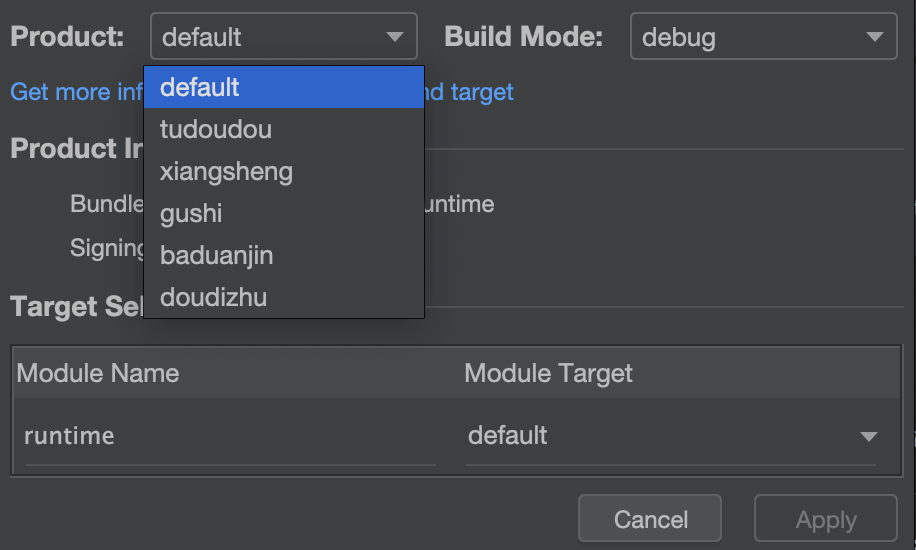

# quicktvui-ohos

## build
本项目依赖`hippy_ohos_tv`及`hippy_ohos_tv_extend`请确保以下项目结构：
```
Workspace/
├── quicktvui-ohos/     (当前项目)__
├── hippy_ohos_tv/      (依赖项目)
└── hippy_ohos_tv_extend/ (依赖项目)
```


## 按渠道打包
**暂未上传多包的签名文件**



**VUE代码替换**
替换 runtime/src/渠道名/resources/rawfile下文件即可

